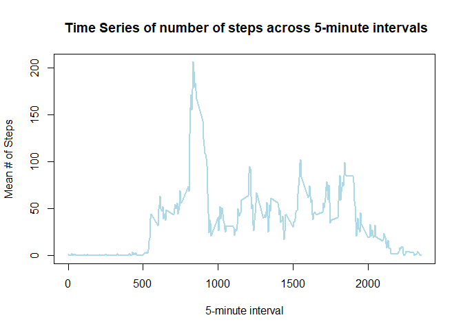

**Author**        : Philip Camp  
**Date Created**  :2018-11-04 13:34:43

The following is a report generated as a part of the Coursera Reproducible Research first course project.  

## Introduction

It is now possible to collect a large amount of data about personal
movement using activity monitoring devices such as a
[Fitbit](http://www.fitbit.com), [Nike
Fuelband](http://www.nike.com/us/en_us/c/nikeplus-fuelband), or
[Jawbone Up](https://jawbone.com/up). These type of devices are part of
the "quantified self" movement -- a group of enthusiasts who take
measurements about themselves regularly to improve their health, to
find patterns in their behavior, or because they are tech geeks. But
these data remain under-utilized both because the raw data are hard to
obtain and there is a lack of statistical methods and software for
processing and interpreting the data.

This assignment makes use of data from a personal activity monitoring
device. This device collects data at 5 minute intervals through out the
day. The data consists of two months of data from an anonymous
individual collected during the months of October and November, 2012
and include the number of steps taken in 5 minute intervals each day.

## Data

The data for this assignment can be downloaded from the course web
site:

* Dataset: [Activity monitoring data](https://d396qusza40orc.cloudfront.net/repdata%2Fdata%2Factivity.zip) [52K]

The variables included in this dataset are:

* **steps**: Number of steps taking in a 5-minute interval (missing
    values are coded as `NA`)

* **date**: The date on which the measurement was taken in YYYY-MM-DD
    format

* **interval**: Identifier for the 5-minute interval in which
    measurement was taken


The dataset is stored in a comma-separated-value (CSV) file and there
are a total of 17,568 observations in this
dataset.


## 1.0 Loading and preprocessing the data

### Load necessary packages

```r
# Library packages
library(plyr)
library(dplyr)
library(ggplot2)
```


### Code for reading in the dataset and/or processing the data

```r
# Set data download location and file name
dataURL   <- "https://d396qusza40orc.cloudfront.net/repdata%2Fdata%2Factivity.zip"
dataName  <- "activity.csv"

# If data is not in working directory, download data
if(!(dataName %in% list.files())){
  
  # Create temp file, download, and unzip data
  temp      <- tempfile()
  download.file(url = dataURL, destfile = temp)
  unzip(temp, "activity.csv")
  unlink(temp)
}

# Load data
activityData    <- read.table("activity.csv", sep = ",", header = TRUE, stringsAsFactors = FALSE)
```


## 2.0 What is mean total number of steps taken per day?

What is mean total number of steps taken per day?
For this part of the assignment, you can ignore the missing values in the dataset.

1. Calculate the total number of steps taken per day
2. Calculate and report the mean and median of the total number of steps taken per day

### Histogram of the total number of steps taken each day

```r
# Calculate the total number of steps taken per day
aggData <- ddply(activityData, ~ date, summarize, sumSteps = sum(steps, na.rm = TRUE))  

# Generate a histogram
hist(aggData$sumSteps, main = "Histogram of Total Number of Steps by Day",
     xlab = "Number of Steps", col = "grey")
```

<!-- -->

### Mean and median number of steps taken each day

```r
# Echo the mean and median total number of steps taken per day
mean(aggData$sumSteps, na.rm = TRUE)
```

```
## [1] 9354.23
```

```r
median(aggData$sumSteps, na.rm = TRUE)
```

```
## [1] 10395
```


## 3.0 What is the average daily activity pattern?

1. Make a time series plot of the 5-minute interval (x-axis) and the average number of steps taken, averaged across all days (y-axis)
2. Which 5-minute interval, on average across all the days in the dataset, contains the maximum number of steps?

### Time series plot of the average number of steps taken

```r
aggData2     <- ddply(activityData, ~ interval, summarize, meanSteps = mean(steps, na.rm = TRUE))
plot(aggData2$interval, aggData2$meanSteps, type = "l", ylab = "Mean # of Steps", xlab = "5-minute interval",
     main = " Time Series of number of steps across 5-minute intervals",
     lwd = 2, col = "lightblue")
```

<!-- -->

### The 5-minute interval that, on average, contains the maximum number of steps

```r
aggData2[which.max(aggData2$meanSteps), "interval"]
```

```
## [1] 835
```

## 4.0 Imputing missing values

1. Calculate and report the total number of missing values in the dataset (i.e. the total number of rows with NAs)
2. Devise a strategy for filling in all of the missing values in the dataset. The strategy does not need to be sophisticated. For example, you could use the mean/median for that day, or the mean for that 5-minute interval, etc.
3. Create a new dataset that is equal to the original dataset but with the missing data filled in.
4. Make a histogram of the total number of steps taken each day and Calculate and report the **mean** and **median** total number of steps taken per day. Do these values differ from the estimates from the first part of the assignment? What is the impact of imputing missing data on the estimates of the total daily number of steps?

### Calculate and report the total number of missing values in the dataset

```r
# Create an NA index
naIndex <- which(is.na(activityData$steps))

# Echo the number of missing values
length(naIndex)
```

```
## [1] 2304
```

### Code to describe and show a strategy for imputing missing data

```r
# Create an index for intervals with NAs
intervalSeq <- sort(unique(activityData[naIndex,]$interval))

# Match each interval and replace NAs with that mean value
for(i in seq_along(intervalSeq)){
  
  # Replace the NAs within each interval by its mean
  activityData[naIndex[which(activityData[naIndex,]$interval == intervalSeq[i])], "steps"] <- aggData2[i, "meanSteps"]
}
```

### Histogram of the total number of steps taken each day after missing values are imputed

```r
# Aggregate data by day (date) and sum the steps
aggData3 <- ddply(activityData, ~ date, summarize, sumSteps = sum(steps, na.rm = TRUE))  

# Create a histogram of the total number of steps by day
hist(aggData3$sumSteps, main = "Histogram of Total Number of Steps by Day",
     xlab = "Number of Steps", col = "lightblue")
```

<!-- -->

### Do these values differ from the estimates from the first part of the assignment? 
What is the impact of imputing missing data on the estimates of the total daily number of steps?


```r
mean(aggData3$sumSteps, na.rm = TRUE)
```

```
## [1] 10766.19
```

```r
median(aggData3$sumSteps, na.rm = TRUE)
```

```
## [1] 10766.19
```

1. The values between before and after imputing do differ.
2. The impact of imputing missing values brings the **mean** and **median** closer together, as well as increases both the **mean** and **median**  

## 5.0 Are there differences in activity patterns between weekdays and weekends?

1.0 Create a new factor variable in the dataset with two levels - "weekday" and "weekend" indicating whether a given date is a weekday or weekend day.

2.0 Make a panel plot containing a time series plot of the 5-minute interval (x-axis) and the average number of steps taken, averaged across all weekday days or weekend days (y-axis). 

### Create  factor variable indicating weekday or weekend

```r
# Create a weekday vector
weekdays <- c("Monday", "Tuesday", "Wednesday", "Thursday", 
              "Friday")

# Convert the day of the week to a factor of weekday or weekend
activityData$DayOfWeek <- as.factor(ifelse(is.element(weekdays(as.Date(activityData$date)),weekdays), "Weekday", "Weekend"))
```

### Panel plot comparing the average number of steps taken per 5-minute interval across weekdays and weekends

```r
# Aggregate data by interval and Day of the week, and summarize data by mean steps
aggData4  <- ddply(activityData, .(interval, DayOfWeek), summarize, meanSteps = mean(steps))

# Plot a panel plot by weekday or weekend
ggplot(aggData4, aes(x = interval, y = meanSteps)) + geom_line() + facet_wrap(~DayOfWeek, ncol = 1) +
  xlab("Mean # of Steps") + ylab("5-minute Interval")
```

<!-- -->

The center of the data shifts right on weekends with the average number of steps increasing.
